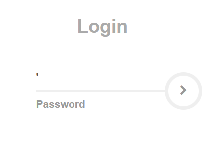
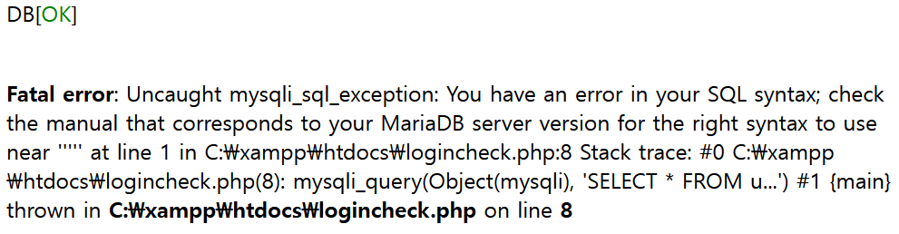
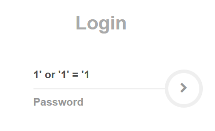
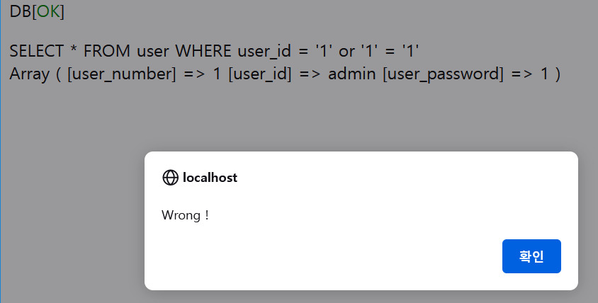
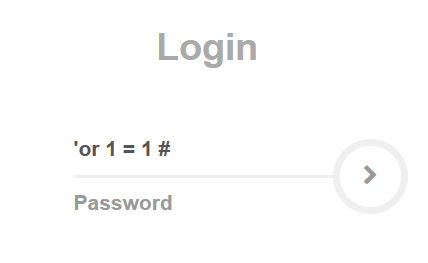
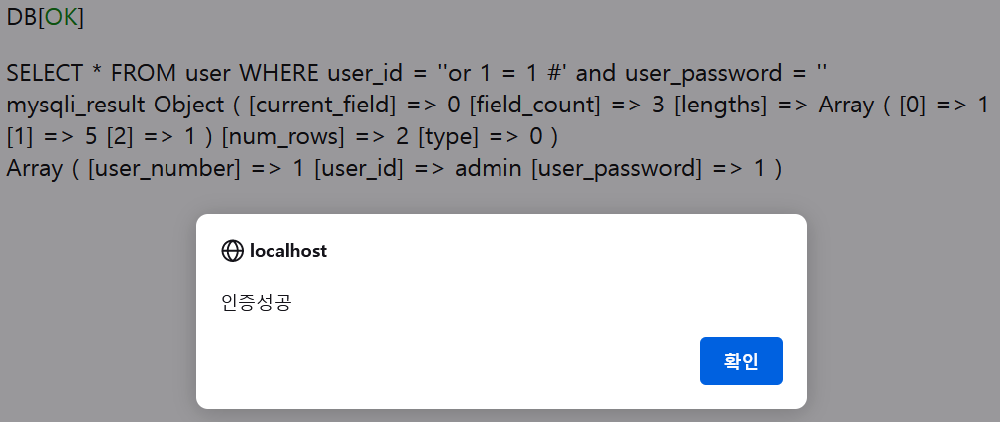

### Error Base SQL Injection

- SQL Injection 공격 기법 중 하나로 클라이언트 입력 값을 조작하여 해당 서버의 데이터베이스를 공격한다.
- '(따옴표, 싱글쿼터) #(DB주석)을 이용하여 쿼리문으로 로그인 우회, 데이터 추출을 행한다.

### Error Base SQL Injection in MiniWeb v1.0
<br>
1. 대상 웹사이트에서 인젝션 공격에 대해 적절한 입력값 검증을 하지 않았거나 개발 중 PHP 에러 메시지를 표시하게 설정을 해두고 까먹은 경우가 있다 이런 상황에서 공격자는 따옴표 하나를 입력함으로써 SELECT * FROM user WHERE user_id = ''' 쿼리문이 전송되고 이와 같은 실수로 인해 해당 웹페이지에 SQL 구문의 문법적 오류가 출력된다. SQLi에 취약하다는 정보를 습득할 가능성이 있다고 생각한다. <br><br>

- PHP 오류 메시지 출력을 설정 했을 때 따옴표를 입력 해보았다. <br><br>

<p align = "center">
 <br>

</p>


- `SELECT * FROM user WHERE user_id = '''`구문이 실행되어 문법적인 오류가 출력된 것을 확인할 수 있다. 이러한 정보들을 바탕으로 SQLi에 취약할 수도 있다는 것을 알 수 있다.

- PHP 오류 메시지를 출력하지 않도록 설정했을 때 따옴표를 입력 해보았다.
```php
mysqli_report(MYSQLI_REPORT_OFF);
ini_set( "display_errors", 'off' );
```
<br>

<p align = "center">

</p>

---

2. MiniWeb v1.0에서 SQLi를 시도해보자

```php
$sql = "SELECT * FROM user WHERE user_id = '$user_id'";
$result = mysqli_query($conn, $sql);
$user = mysqli_fetch_assoc($result);
print_r($sql); echo "<br>"; // sql 구문 출력
print_r($user); // 쿼리에 대한 결과값 출력
```
<p align = "center">
 <br>

</p>

- `SELECT * FROM user WHERE user_id = '1' or '1' = '1`  쿼리문이 전송되었고 결과값이 데이터베이스 내의 정보가 출력되었다. `mysqli_fetch_assoc($result)` 함수는 mysqli_query에서 얻은 리절트 셋에서 레코드를 1개씩 리턴해주기 때문에 첫 번째 정보에 있는 user_id = admin 만이 출력되었지만 `SELECT * FROM user WHERE user_id = '1' or '1' = '1` 질의는 user_id의 값이 '1' 이거나 '1'은'1'이라는 항상 참인 조건이 성립된다. 간단하게 표현하자면 user_id==1 or 1==1 되는 셈인데 id가 틀리더라도 다음 내용인 1==1은 항상 참이기 때문에 user 테이블 안의 모든 정보를 출력하게 되는 것이다.

---

3. v1.0에서는 ID식별과 인증을 분리하여 구현하였기 때문에 인증 기존 코드를 수정하여 식별과 인증을 동시에 하도록 재구현하였다. <br>

- 주석을 이용해 인젝션을 시도해보자 <br>

```php
<?php
    include("./db_connetcion.php");
    
    $user_id = trim($_POST['user_id']);
    $user_password = trim($_POST['user_password']);
    
    $sql = "SELECT * FROM user WHERE user_id = '$user_id' and user_password = '$user_password'";
    $result = mysqli_query($conn, $sql);
    $user = mysqli_fetch_assoc($result);
    print_r($sql); echo "<br>";
    print_r($result); echo "<br>";
    print_r($user);

    if(!$result){
        echo "Error";
        exit;
    } 

    if($user['user_id']) {
        echo "<script>alert('인증성공');</script>";
        echo "<script>location.replace('./success.php');</script>"; 
    }
    else {
        echo "<script>alert('Wrong !');</script>";
    }
?>
```


<p align = "center">
 <br>

</p>

- `SELECT * FROM user WHERE user_id = '' or 1 = 1 #' and user_password = ''` 쿼리가 전송 되었고 쉽게 인증이 되었다. # 이하의 모든 구문은 주석처리 되면서 `SELECT * FROM user WHERE user_id = '' or 1 = 1` 가 되었고 항상 참인 값이 되었기 때문에 쉽게 인증에 성공할 수 있다.

---
### key Takeaways

공백에 대한 입력처리도 구현하지 않고 여러 보안적인 측면에서 허점이 많지만 SQLi의 원리에 대하여 조금이라도 더 자세히 알게 되는 계기가 되었다. 특히 밑에처럼 동시에 ID와 패스워드를 조회하여 그것을 근거로 아이디만으로 인증하는 방식은 정말 취약한 방법이라고 생각 된다. 이런식으로 구현되어 있다면 단순히 계정만 알고 있더라도 `ID'#` 하나만으로 인증이 될 것이다.
```php
$sql = "SELECT * FROM user WHERE user_id = '$user_id' and user_password = '$user_password'";

    if($user['user_id']) {
        echo "<script>alert('인증성공');</script>";
        echo "<script>location.replace('./success.php');</script>"; 
    }
```

[TOP](error-base-sql-injection)


