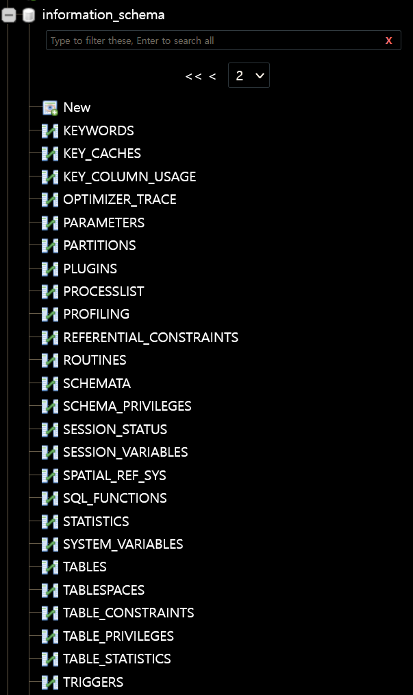
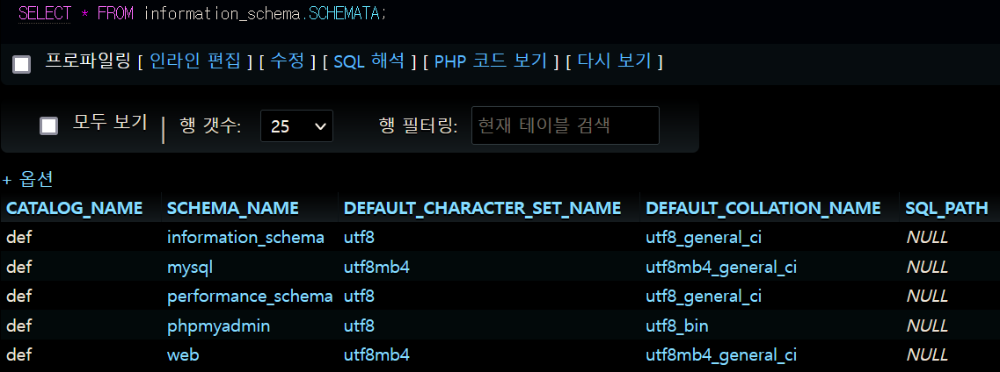
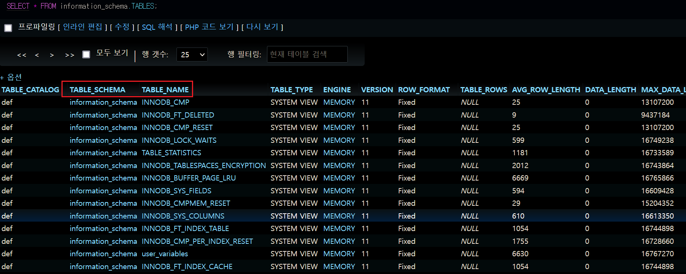
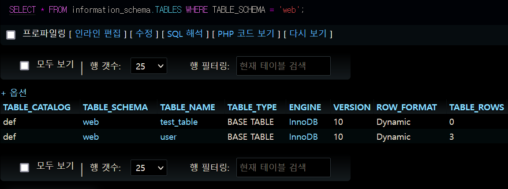
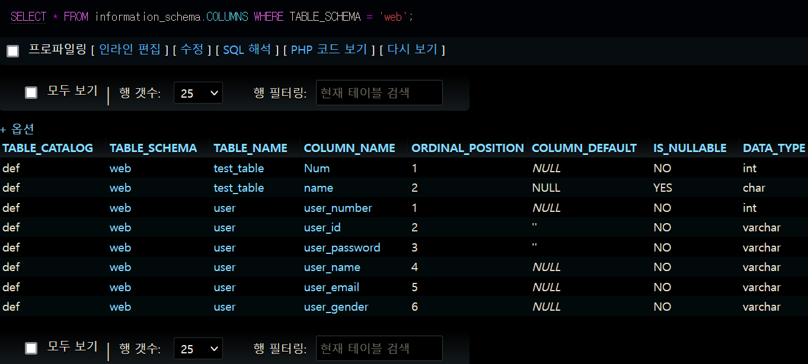

### information_schema
- MySQL 내에 존재하는 정보들을 모아둔 하나의 데이터베이스이며 해당 정보들을 메타 데이터(Metadata), 데이터 사전(Data dictionary), 시스템 카탈로그(System catalog) 라고 지칭한다.
- 메타 데이터에는 데이터베이스, 테이블, 컬럼, 컬럼의 데이터 타입, 접근 권한 등 대부분의 데이터가 저장 되어 있다.
- information_schema 데이터베이스는 모두 읽기 전용으로서 조회만 가능하므로 수정 및 삭제할 수 없다.
- Oracle에도 메타 데이터가 존재하지만 SQL 문법차이가 있다.
---

- 웹 해킹에 활용할 수 있는 테이블에 대해서만 작성한다.



> information_schema 데이터베이스의 테이블 일부

---

- SCHEMATA : 데이터베이스의 정보를 제공

```
SELECT * FROM information_schema.SCHEMATA
```



---

- TABLES : 데이터베이스에 존재하는 테이블에 대한 정보 제공


```
SELECT * FROM information_schema.TABLES
```



- 빨간 박스의 TABLES_SCHEMA는 데이터베이스 이름이며 TABLE_NAME은 해당 데이터베이스의 테이블 이름이다.

```
SELECT * FROM information_schema.TABLES WHERE TABLE_SCHEMA = 'web'
```



- Web 데이터베이스 테이블 목록 질의

---

- COLUMNS : 모든 스키마의 컬럼 정보 제공

```
SELECT * FROM information_schema.COLUMNS WHERE TABLE_SCHEMA = 'web'
```


---