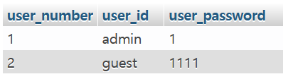
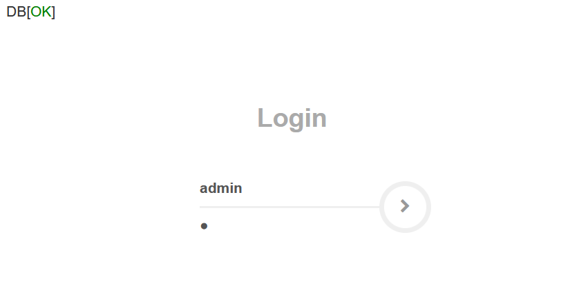
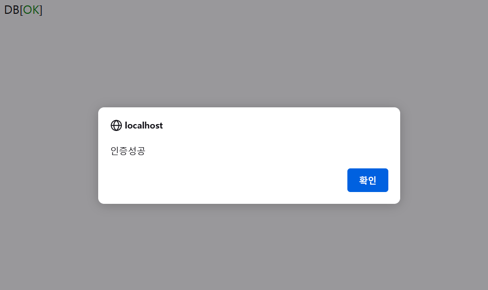

### Web v1.0
- 웹 관련 해킹 기법의 정확한 원리를 파악하기 위해 직접 로그인 기능만을 구현한 WEB
- 기본적으로 취약한 환경으로 구성
---
### Tools
- MySql
- Apache
- Bootstrap
- PHP
---

### Description

1. 간단한 로그인만을 구현하기 위해 기본키로 사용할 user_number 필드, user_id 필드, user_password 필드를 구성했으며, 회원가입 기능이 아직 구현되어 있지 않기 때문에 회원 정보는 임의로 등록함

```
CREATE TABLE user (
    user_number INT(11) NOT NULL AUTO_INCREMENT,
    user_id VARCHAR(20) NOT NULL DEFAULT '',
    user_password VARCHAR(20) NOT NULL DEFAULT '',
    PRIMARY KEY (user_number),
    UNIQUE KEY (user_id)
);

INSERT INTO user VALUES(DEFAULT, 'admin', '1');
INSERT INTO user VALUES(DEFAULT, 'guest', '1111');
```



---

2. PHP와 Mysql을 연동시키기 위해 MySQLi 확장 API 절차 지향 스타일로 연동

```php
<?php
    mysqli_report(MYSQLI_REPORT_OFF);
    ini_set( "display_errors", 'off' );

    $mysql_host = "localhost";
    $mysql_user = "root";
    $mysql_password = "";
    $mysql_db = "web";
    
    $conn = mysqli_connect($mysql_host, $mysql_user, $mysql_password, $mysql_db);

    if(!$conn) {
        echo "<script>alert('DB Error');</script>";
        exit;
    }
    
    echo '<p>DB[<span style="color:green">OK</span>]</p>';

    session_start();
?>
```
---

3. 부트스트랩을 사용하여 로그인화면을 구현
<br><br>
```html
<?php
    include("./db_connetcion.php")
?>

<html>
    <head>
        <link rel="stylesheet" href="./login.css">
        
        <link href="//maxcdn.bootstrapcdn.com/bootstrap/3.3.0/css/bootstrap.min.css" rel="stylesheet" id="bootstrap-css">
        <script src="//maxcdn.bootstrapcdn.com/bootstrap/3.3.0/js/bootstrap.min.js"></script>
        <script src="//code.jquery.com/jquery-1.11.1.min.js"></script>
        <link rel="stylesheet" href="//maxcdn.bootstrapcdn.com/font-awesome/4.3.0/css/font-awesome.min.css">
        <link href='https://fonts.googleapis.com/css?family=Varela+Round' rel='stylesheet' type='text/css'>
        <script src="https://cdnjs.cloudflare.com/ajax/libs/jquery-validate/1.13.1/jquery.validate.min.js"></script>
        <meta name="viewport" content="width=device-width, initial-scale=1, maximum-scale=1" />
    <title>Login</title>
    </head>
    <body>
        <div class="text-center" style="padding:50px 0">
            <div class="logo">Login</div>
            <div class="login-form-1">
                <form action="./logincheck.php" id="login-form" class="text-left" method="post">
                    <div class="login-form-main-message"></div>
                    <div class="main-login-form">
                        <div class="login-group">
                            <div class="form-group">
                                <label for="user_id" class="sr-only">ID</label>
                                <input type="text" class="form-control" id="user_id" name="user_id" placeholder="ID">
                            </div>
                            <div class="form-group">
                                <label for="user_password" class="sr-only">Password</label>
                                <input type="password" class="form-control" id="user_password" name="user_password" placeholder="Password">
                            </div>
                        </div>
                        <button type="submit" class="login-button"><i class="fa fa-chevron-right"></i></button>
                    </div>
                </form>
            </div>
        </div>

    </body>
</html>
```
---

4. 로그인 인증 구현
```php
<?php
    include("./db_connetcion.php");
    
    $user_id = trim($_POST['user_id']);
    $user_password = trim($_POST['user_password']);
    
    $sql = "SELECT * FROM user WHERE user_id = '$user_id' and user_password = '$user_password'";

    $result = mysqli_query($conn, $sql);
    $user = mysqli_fetch_assoc($result);

    if(!$result){
        echo "Error";
        exit;
    } 

    if($user['user_id']) {
        echo "<script>alert('인증성공');</script>";
        echo "<script>location.replace('./success.php');</script>"; 
    }
    else {
        echo "<script>alert('인증실패');</script>";
        echo "<script>location.replace('./index.php');</script>"; 
    }
?>
```

- 사용자가 입력한 패스워드와 DB에서의 user_password는 암호화 함수를 사용하지 않음

---

```php
    if(!$user['user_id'] || !($user_password == $user['user_password'])){
        echo "<script>alert('Wrong !');</script>";
        echo "<script>location.replace('./index.php')</script>";
        exit;
    }
```
- 위와 같은 이유로 사용자가 입력한 패스워드와 DB에 저장된 패스워드를 평문으로 비교하도록 구현함
---
<br>

<p align="center">



</p>
