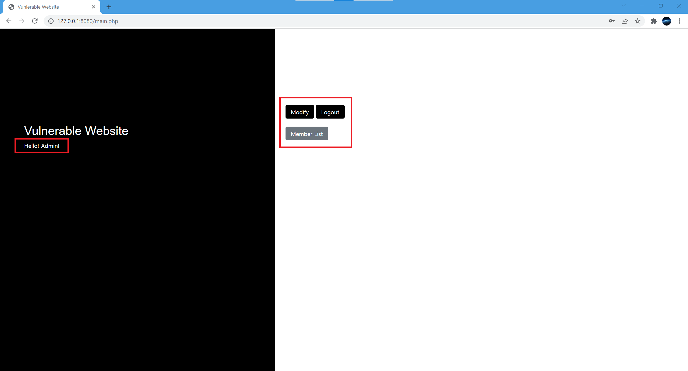
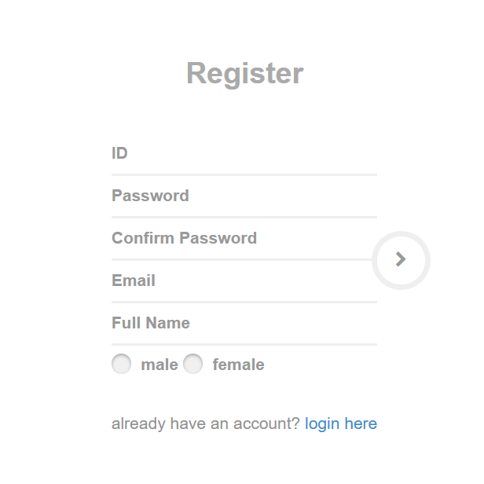
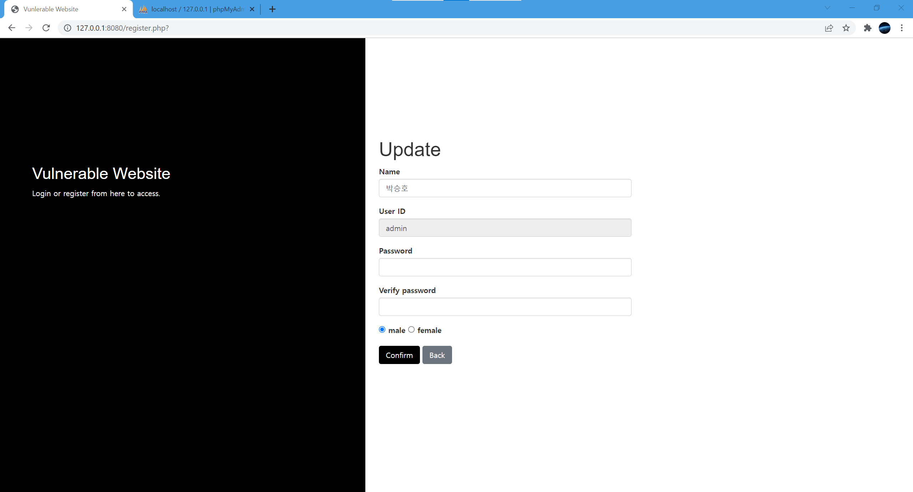
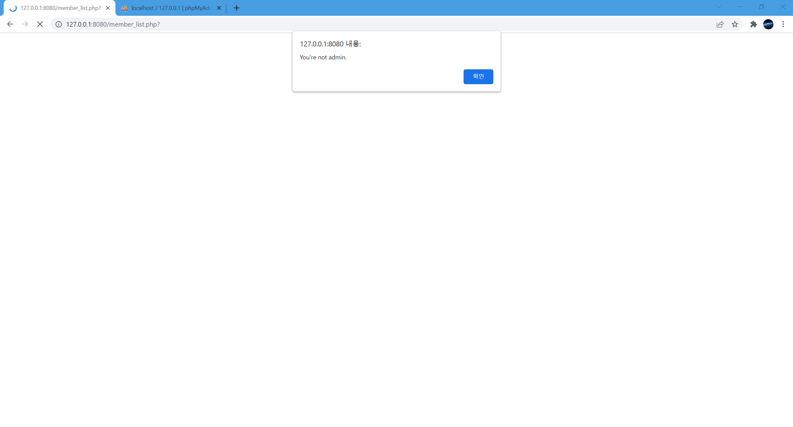
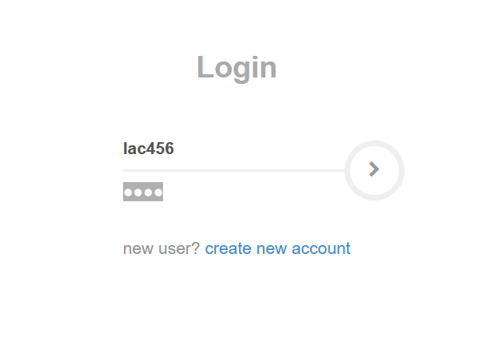
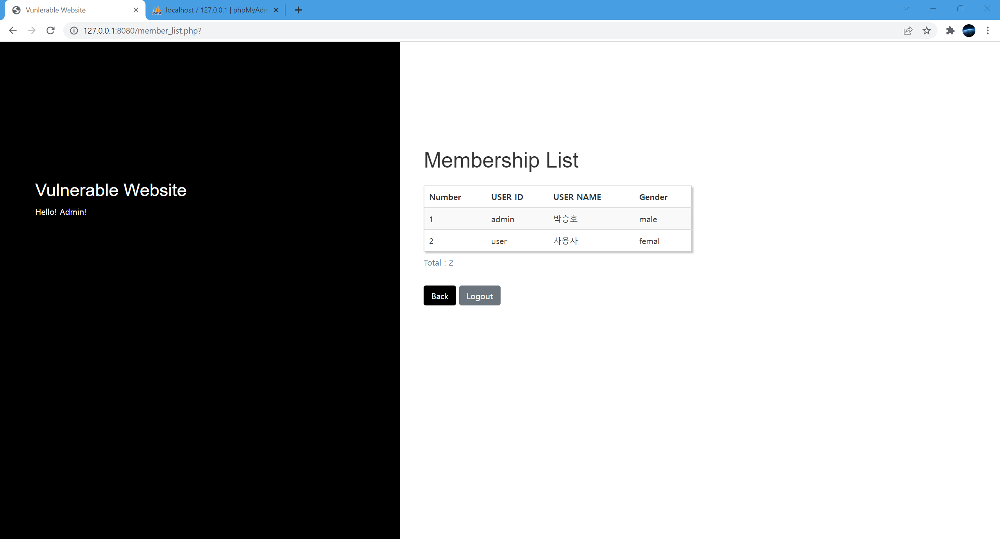
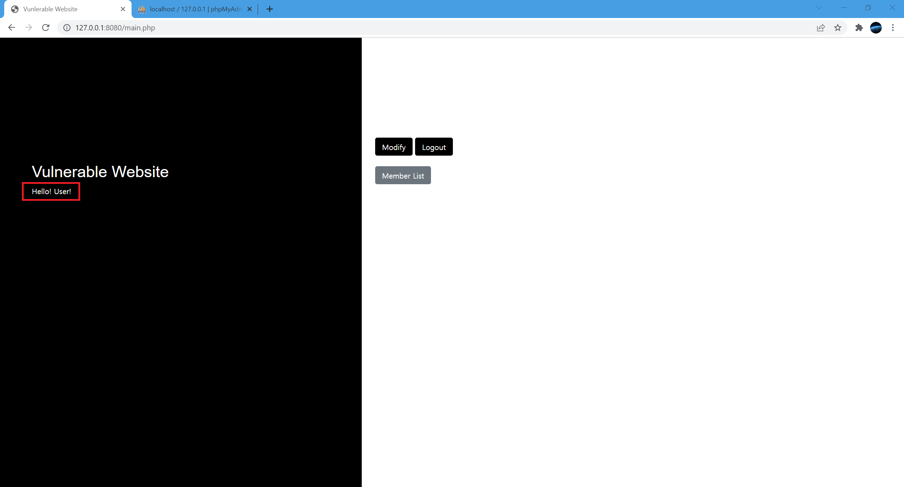

### Web v1.01
- 웹 관련 해킹 기법의 정확한 원리를 파악하기 위해 구현한 WEB
- 기본적으로 취약한 환경으로 구성

### Web v1.01 패치노트
- 회원가입 페이지, 기능 추가
---
### Tools
- MySql
- Apache
- Bootstrap
- PHP
---

### Description

- 회원가입 기능을 추가하기 위해 데이터베이스 컬럼 추가


---

2. 부트스트램을 이용하여 회원가입 페이지 구현

```html
<div class="etc-login-form">
    <p>new user? <a href="./register.php">create new account</a></p>
</div>
```


- 기존 로그인 페이지에 회원가입 페이지로 이동하는 링크 추가

---

```php
<?php
    include("db_connetcion.php");
    $mode = "insert";
?>

<html>
<head>
    <title>회원가입</title>
    <link rel="stylesheet" href="./login.css">
    <link href="//maxcdn.bootstrapcdn.com/bootstrap/3.3.0/css/bootstrap.min.css" rel="stylesheet" id="bootstrap-css">
<script src="//maxcdn.bootstrapcdn.com/bootstrap/3.3.0/js/bootstrap.min.js"></script>
<script src="//code.jquery.com/jquery-1.11.1.min.js"></script>
<!------ Include the above in your HEAD tag ---------->

<!-- All the files that are required -->
<link rel="stylesheet" href="//maxcdn.bootstrapcdn.com/font-awesome/4.3.0/css/font-awesome.min.css">
<link href='https://fonts.googleapis.com/css?family=Varela+Round' rel='stylesheet' type='text/css'>
<script src="https://cdnjs.cloudflare.com/ajax/libs/jquery-validate/1.13.1/jquery.validate.min.js"></script>
<meta name="viewport" content="width=device-width, initial-scale=1, maximum-scale=1" />
</head>
<body>
<!-- REGISTRATION FORM -->
<div class="text-center" style="padding:50px 0">
	<div class="logo">Register</div>
	<!-- Main Form -->
	<div class="login-form-1">
		<form action="./RegisterCheck.php" id="register-form" class="text-left" method="post">
            <input type="hidden" name="mode" value="<?php echo $mode ?>">
			<div class="login-form-main-message"></div>
			<div class="main-login-form">
				<div class="login-group">
					<div class="form-group">
						<label for="user_id" class="sr-only">Email address</label>
						<input type="text" class="form-control" id="user_id" name="user_id" placeholder="ID">
					</div>
					<div class="form-group">
						<label for="user_password" class="sr-only">Password</label>
						<input type="password" class="form-control" id="user_password" name="user_password" placeholder="Password">
					</div>
					<div class="form-group">
						<label for="user_password_confirm" class="sr-only">Password Confirm</label>
						<input type="password" class="form-control" id="user_password_confirm" name="user_password_confirm" placeholder="Confirm Password">
					</div>
					
					<div class="form-group">
						<label for="user_email" class="sr-only">Email</label>
						<input type="text" class="form-control" id="user_email" name="user_email" placeholder="Email">
					</div>
					<div class="form-group">
						<label for="user_name" class="sr-only">Full Name</label>
						<input type="text" class="form-control" id="user_name" name="user_name" placeholder="Full Name">
					</div>
					
					<div class="form-group login-group-checkbox">
						<input type="radio" class="" name="user_gender" id="male" placeholder="male" value="male">
						<label for="male">male</label>
						
						<input type="radio" class="" name="user_gender" id="female" placeholder="female" value="female">
						<label for="female">female</label>
					</div>
				</div>
				<button type="submit" class="login-button"><i class="fa fa-chevron-right"></i></button>
			</div>
			<div class="etc-login-form">
				<p>already have an account? <a href="./index.php">login here</a></p>
			</div>
		</form>
	</div>
	<!-- end:Main Form -->
</div>
</body>
</html>
```



---
3. 회원가입 기능 구현

```php
<?php
    include("./db_connetcion.php");

    $mode = $_POST['mode'];

    switch ($mode) {
        case 'insert' :
            $user_id = trim($_POST['user_id']);
            break;
    }
   
    if(!$_POST['user_id']){
        echo "<script> alert('아이디를 입력하세요.'); </script>";
        echo "<script> location.replace('./Register.php')</script>";
    }

    if(!$_POST['user_password']){
        echo "<script> alert('패스워드를 입력하세요.'); </script>";
        echo "<script> location.replace('./Register.php')</script>";
    }

    if($_POST['user_password'] != $_POST['user_password_confirm']){
        echo "<script> alert('패스워드가 일치하지 않습니다.'); </script>";
        echo "<script> location.replace('./Register.php')</script>";
    }

    if(!$_POST['user_email']){
        echo "<script> alert('이메일을 입력하세요.'); </script>";
        echo "<script> location.replace('./Register.php')</script>";
    }

    if(!$_POST['user_name']){
        echo "<script> alert('이름을 입력하세요.'); </script>";
        echo "<script> location.replace('./Register.php')</script>";
    }

    if(!$_POST['user_gender']){
        echo "<script> alert('성별을 고르세요.'); </script>";
        echo "<script> location.replace('./Register.php')</script>";
    }


    $user_password = trim($_POST['user_password']);
    $user_email = trim($_POST['user_email']);
    $user_name = trim($_POST['user_name']);
    $user_gender = $_POST['user_gender'];


    if ($mode == "insert"){
        $sql = "SELECT * FROM user WHERE user_id = '$user_id'";
        $result = mysqli_query($conn, $sql);
        if(mysqli_num_rows($result) > 0){
            echo "<script> alert('아이디가 이미 존재합니다.'); </script>";
            echo "<script> location.replace('./Register.php')</script>";
        }

        $sql = "INSERT INTO user
                    SET user_id = '$user_id',
                        user_password = '$user_password',
                        user_email = '$user_email',
                        user_name = '$user_name',
                        user_gender = '$user_gender'";
        
        $result = mysqli_query($conn, $sql);
    }

    if($result) {
        echo "<script>alert('회원가입 완료');</script>";
        echo "<script> location.replace('./index.php')</script>";
        exit;
    }
    else {
        echo "<script>alert('회원가입 실패');</script>";
        echo "<script> location.replace('./index.php')</script>";
    }
?>
```
- 회원가입에 필요한 데이터 입력



- 회원가입 후 DB에 입력된 데이터



- 등록된 계정으로 로그인 시도




---

- 이미 존재하는 계정으로 로그인 시도



- 존재하는 계정은 경고창 알림




---


